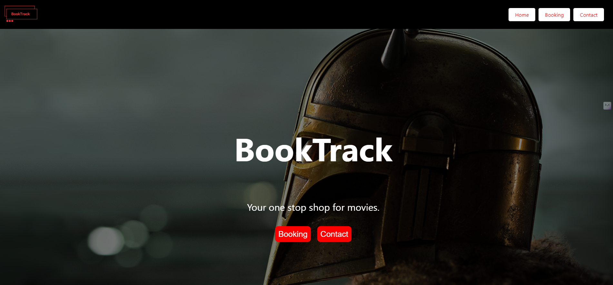
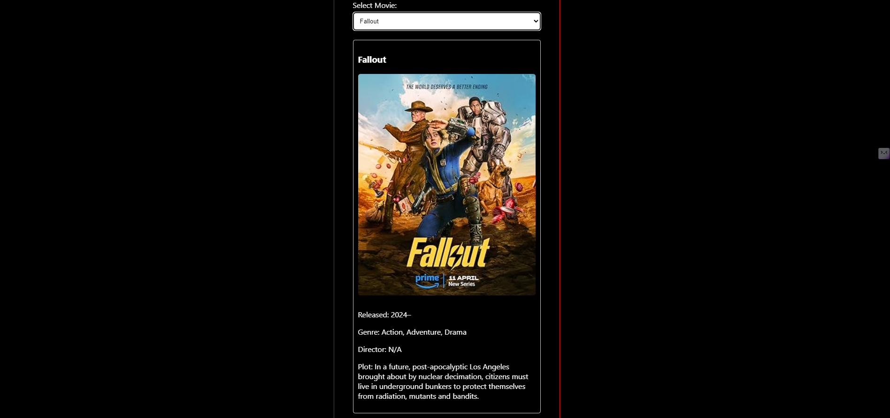
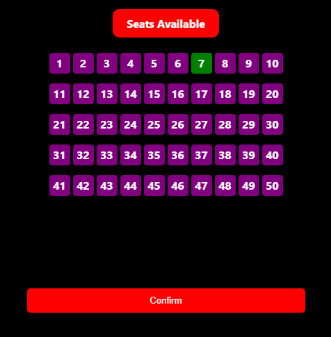

# Book Track

Book Track is a web application that allows users to book movie tickets online.

## Features

- Browse available movies
- Select a movie and book tickets
- Choose seats in the theater
- Generate a receipt with booking details

## Technologies Used

- React.js
- Axios
- HTML/CSS
- JavaScript

## Setup Instructions

1. Clone the repository:

```bash
git clone https://github.com/your-username/book-track.git
```
2. Navigate to the project directory
  cd BookTrack

3. Install dependencies
```bash
  npm install
```
4. Start the development server
```bash
npm start
```
## Screenshots 





## Acknowledgements

- The OMDB API (Open Movie Database) for providing movie data and metadata for the app.

## License

This project is licensed under the [MIT License](LICENSE).
